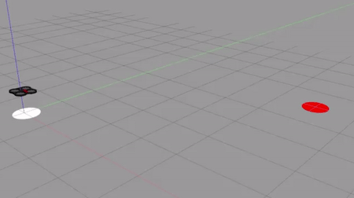

# RL4UAV - Reinforcement Learning for Autonomous navigation of UAV's (indoors) 
(1) Q-Learning.py : Autonomous Navigation of UAV using Q-Learning (Reinforcement Learning). For discrete action space: 5x5 grid space.

Indoor Path Planning and Navigation of an Unmanned Aerial Vehicle (UAV) based on PID+Q-Learning algorithm (Reinforcement Learning). The quadrotor maneuvers towards the goal point, along the uniform grid distribution in the simulation environment(discrete action space) based on the specified reward policy, backed by the simple position based PID controller.

Reference: Pham, H.X., La, H.M., Feil-Seifer, D. and Nguyen, L.V., 2018. Autonomous UAV Navigation Using Reinforcement Learning. arXiv preprint arXiv:1801.05086.

Platforms and Packages: ROS Kinetic, Gazebo, TUM ArDrone Autonomy, TensorFLow, Numpy

Project Video: https://www.youtube.com/watch?v=SDqPfhUeoCo

(2) DDPG.py : Deep Deterministic Policy Gradient algorithm is used for autonomous navigation of UAV from start to goal position. This is for the continuous action domain. 
